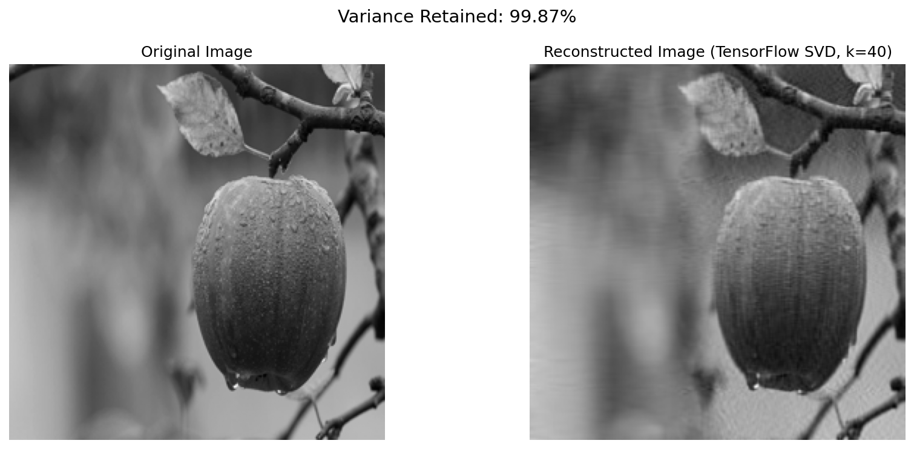

# 01- SVD Image Compression from Scratch

Implements Singular Value Decomposition (SVD) from scratch using power
iteration with deflation, compared against TensorFlow's `tf.linalg.svd`.
Applied to grayscale image compression and reconstruction.



## What this does

- Loads a grayscale image and preprocesses it into a normalized pixel matrix.
- Computes the top-k singular values/vectors using power iteration + deflation
  — no `numpy.linalg.svd` or library shortcuts.
- Reconstructs the image from the top-k components and reports reconstruction
  error (MSE) and % variance retained.
- Repeats the process using `tf.linalg.svd` as a library-based comparison.

## Results (k = 40, image resized to 256×256)

| Method       | MSE      | Variance Retained |
|--------------|----------|--------------------|
| Scratch SVD  | 0.000339 | 99.87%             |
| TensorFlow   | 0.000339 | 99.87%             |

The scratch implementation matches TensorFlow's SVD almost exactly,
confirming the power iteration + deflation approach converges to the
correct result.

## Running it

From the repo root:
```bash
pip install -r requirements.txt
jupyter notebook 01-svd-image-compression/svd_image_compression.ipynb
```

To try your own image, replace `assets/sample_image.jpg` and update
`IMAGE_PATH` in the notebook's configuration cell.