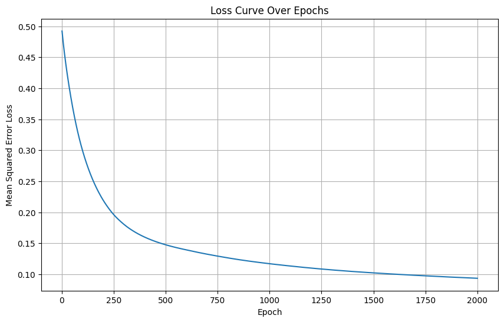
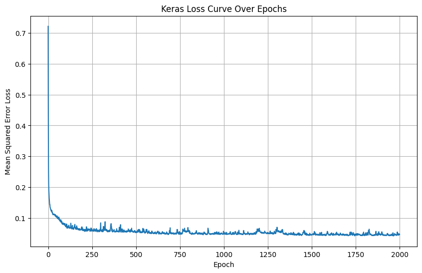
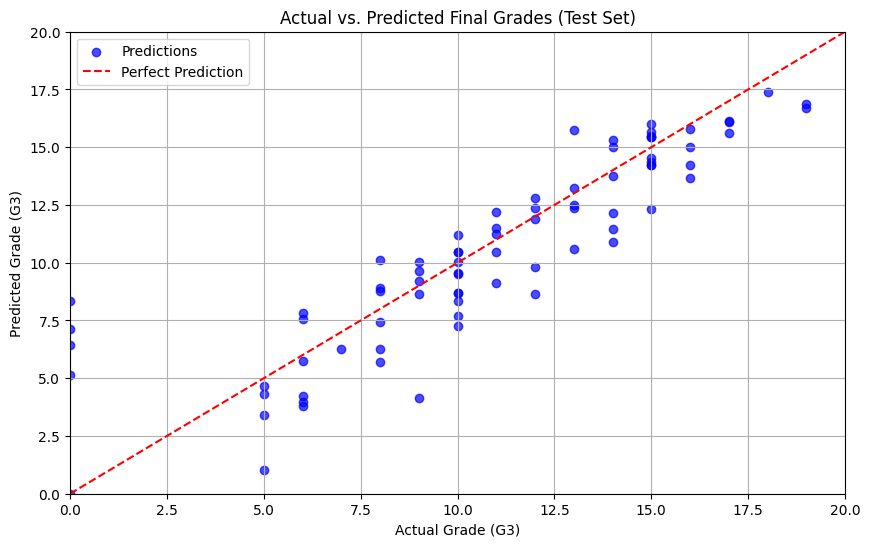
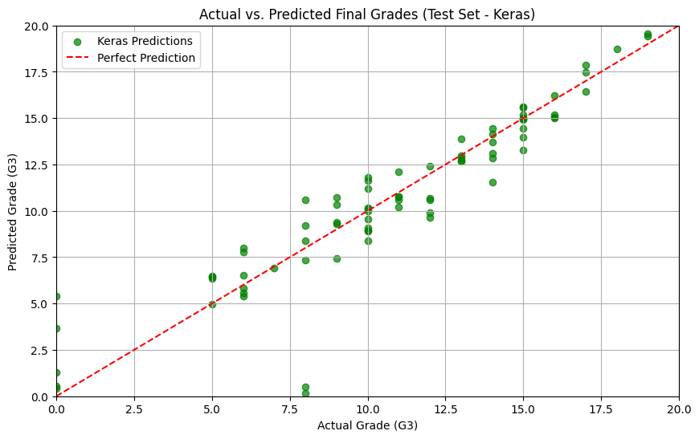

# 02 — Multi-Layer Perceptron (MLP)

Regression model predicting final grade (G3) for students, using an MLP trained 
from scratch (NumPy) and compared against a TensorFlow/Keras implementation.

## Dataset
Student Performance dataset (`student-mat.csv`), using features `studytime`, 
`failures`, `absences`, `G1`, `G2` to predict `G3`.

## Architecture
- Input → Dense(10, ReLU) → Dense(5, ReLU) → Dense(1, Linear)
- Learning rate: 0.01, Epochs: 2000

## Results

| Metric | Scratch (NumPy) | TensorFlow/Keras |
|--------|------------------|-------------------|
| MSE    | 4.8123           | 3.3207            |
| MAE    | 1.5383           | 1.1727           |

## How to run
1. Open `mlp.ipynb` in Google Colab.
2. Run all cells — the dataset downloads automatically from this repo.