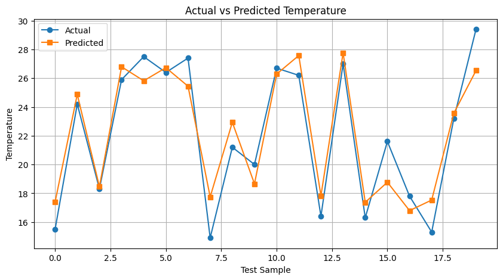
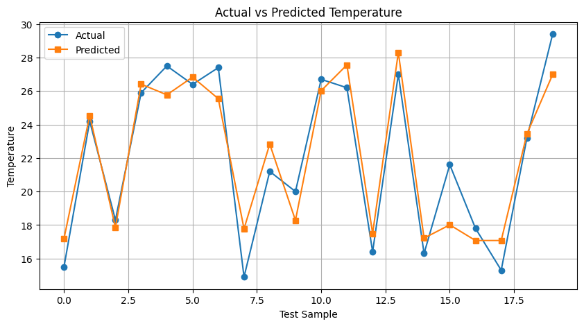

# 03 — Recurrent Neural Network (RNN)

Sequence model predicting next-day temperature from three time steps 
(morning, afternoon, evening), using a vanilla RNN trained from scratch 
(NumPy, full BPTT) and compared against a TensorFlow/Keras SimpleRNN.

## Dataset
`temp_vanilla.csv` — morning/afternoon/evening temperature readings, 
predicting `next_day_temp`.

## Architecture
- Input (T=3, features=1) → SimpleRNN(hidden_size=8, tanh) → Dense(1, Linear)
- Loss: 0.5 × sum of squared error (matched between scratch and Keras)
- Learning rate: 0.001, Epochs: 1000, Batch size: 1 (per-sample updates)

## Results

| Metric | Scratch (NumPy) | TensorFlow/Keras |
|--------|------------------|-------------------|
| MSE    | 2.6384           | 2.6221            |
| MAE    | 1.3939           | 1.3666            |

> **Note:** Keras results vary slightly between runs even with a fixed 
> random seed, likely due to GPU non-determinism in per-sample 
> (`batch_size=1`) SGD training over many epochs. Values above are from a 
> representative run; expect minor fluctuation (~±0.5 MSE) if re-run.

*Actual vs. predicted next-day temperature (scratch NumPy model) across the test set.*

*Actual vs. predicted next-day temperature (Keras model) across the test set.*

## How to run
1. Open `rnn.ipynb` in Google Colab.
2. Run all cells — the dataset downloads automatically from this repo.