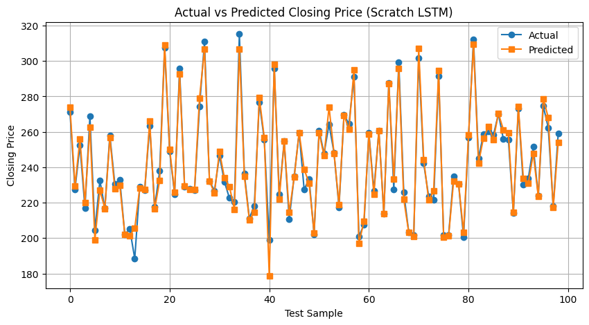
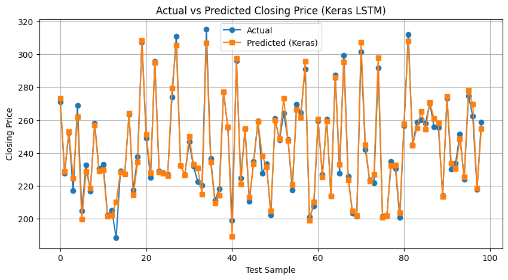

# 04 — LSTM — Stock Price Prediction (Next-Day Close)
A from-scratch NumPy implementation of an LSTM, compared against an equivalent TensorFlow/Keras model, predicting the next day's closing price from a sliding window of prior closes.

## Dataset
AAPL daily closing prices (`data/stock_data.csv`), using a 5-day sliding window of prior closes (`WINDOW_SIZE = 5`) to predict the next day's close.

## Architecture
- **Input**: 5-day sliding window of closing prices (`WINDOW_SIZE = 5`), one feature per day.
- **Scratch model**: Single-layer LSTM (hidden size 8) with forget, input, output, and candidate gates implemented explicitly in NumPy, full backpropagation through time, trained with per-sample online SGD.
- **Keras model**: `tf.keras.layers.LSTM` (hidden size 8) → `Dense(1)` output layer, trained with the Adam optimizer, matched to the scratch version's hyperparameters as closely as Keras allows (full-batch updates to approximate the per-sample update pattern).
- **Output**: Predicted next-day closing price (regression).
- Learning rate: 0.001, Epochs: 1000

## Results
| Metric | Scratch (NumPy) | TensorFlow/Keras |
|--------|------------------|-------------------|
| MSE    | 18.0392 | 17.6525 |
| MAE    | 2.8595  | 2.9239  |
| Epochs | 1000 | 1000 |
| Hidden size | 8 | 8 |
| Window size | 5 | 5 |

## How to run
1. Open `lstm.ipynb` in Google Colab.
2. Run all cells — the dataset downloads automatically from this repo.